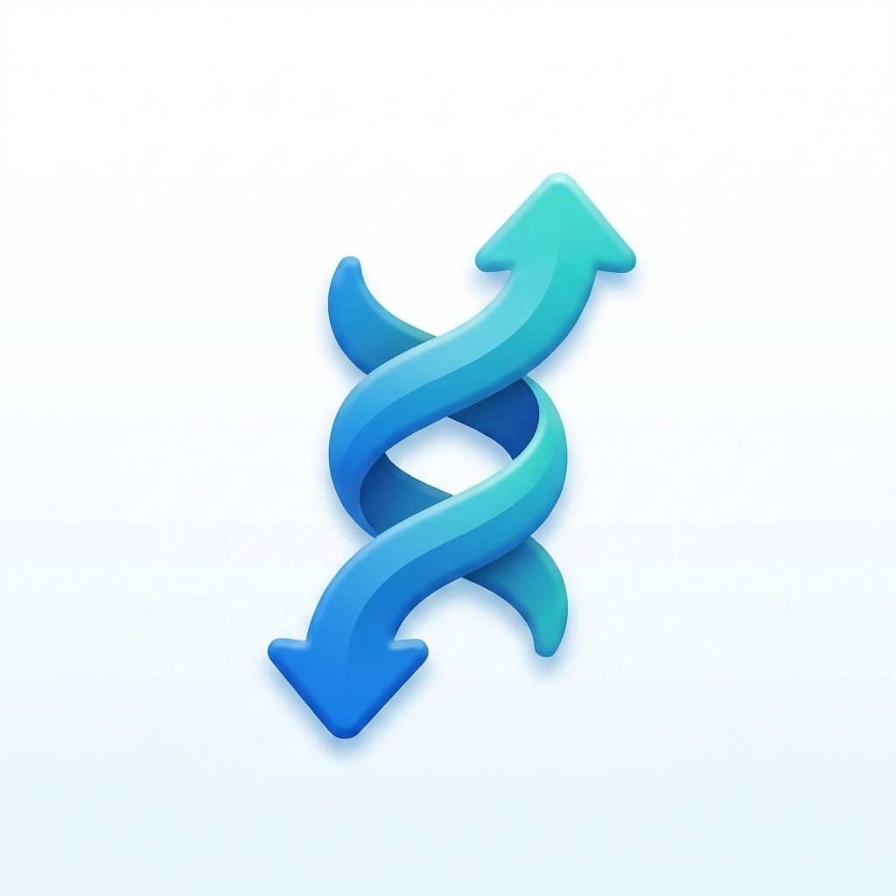

<div align="center">
    
    <h1>Helix</h1>
    <p>A native macOS menu bar app for managing <a href="https://mutagen.io">mutagen</a> file sync and network forwarding sessions.</p>
</div>

<p align="center">
    
    
    
    
    <a href="https://helix.hexul.com"></a>
</p>

---

## Features

- **Menu bar status** -- Live icon reflects overall session health at a glance (healthy, syncing, conflicts, errors)
- **Session dashboard** -- Browse, search, and filter all sync and forward sessions in a three-column window
- **Create sessions** -- Step-by-step wizard for sync sessions; streamlined form for port forwarding
- **Edit sessions** -- Change sync mode, ignore rules, symlinks, compression, and watch settings on existing sessions
- **Conflict resolution** -- Inspect per-file conflicts side by side, keep either side with one click across local, SSH, and Docker endpoints; handles file-vs-directory type mismatches with confirmation before destructive operations
- **Endpoint support** -- Local paths, SSH remotes, and Docker containers with transport-aware file operations
- **Git mismatch detection** -- Detects when a git repo exists on one sync endpoint but not the other, with automatic fix to initialize the missing side
- **Console log** -- Dark-themed (Tokyo Night) panel with timestamped, color-coded CLI output and full multi-line text selection
- **Keyboard shortcuts** -- `Cmd+N` new sync, `Cmd+Shift+N` new forward, `Cmd+R` refresh
- **CLI preview** -- Every create/edit form shows the exact `mutagen` command before you run it, with a copy button
- **Auto-update** -- Built-in Sparkle integration checks for updates from the menu bar
- **Launch at login** -- Optional login item via SMAppService
- **Configurable polling** -- Adjust refresh interval from 2 to 30 seconds
- **Text size** -- Adjustable text size (System Default, Small, Medium, Large, Extra Large) in Settings

## Install

### Homebrew

```sh
brew install --cask hex/tap/helix
```

### Manual

Download the latest `.dmg` from the [releases page](https://github.com/hex/Helix/releases).

### Build from Source

Requires [XcodeGen](https://github.com/yonaskolb/XcodeGen) and Xcode 16+.

```sh
git clone https://github.com/hex/Helix.git
cd Helix
xcodegen generate
xcodebuild -project Helix.xcodeproj -scheme Helix -configuration Release build
```

## Requirements

- macOS 14 (Sonoma) or later
- [mutagen](https://mutagen.io) installed (default path: `/opt/homebrew/bin/mutagen`, configurable in Settings)

## How It Works

Helix is a SwiftUI companion app that wraps the mutagen CLI. It does not embed mutagen or communicate with the daemon directly -- instead it shells out to `mutagen sync list --template '{{json .}}'` and friends, parsing the JSON output into native Swift models.

The architecture is split into two layers:

| Layer | Description |
|-------|-------------|
| **HelixKit** | Swift Package providing models, CLI wrapper, session state management, and cross-transport file operations |
| **App** | SwiftUI menu bar app with views, components, and keyboard commands |

HelixKit defines a `SessionProvider` protocol so the entire CLI surface can be swapped out for testing.

## Project Structure

```
Helix/
  App/
    HelixApp.swift          # Entry point, menu bar + window scenes
    Views/                  # Main window, detail views, create/edit sheets
    Components/             # Reusable UI (StatusBadge, EndpointPicker, etc.)
  Sources/HelixKit/
    CLI.swift               # Concrete mutagen CLI wrapper
    SessionStore.swift      # Observable state + polling
    CommandBuilder.swift    # Typed option structs -> argument arrays
    FileTransport.swift     # Cross-endpoint copy/stat/remove
    Models/                 # SyncSession, ForwardSession, Endpoint, Conflict
  Tests/HelixKitTests/    # Unit and integration tests
  Package.swift             # SPM package for HelixKit
  project.yml               # XcodeGen project definition
```

## License

[MIT License](LICENSE) -- Copyright (c) 2026 [hexul](https://hexul.com)
